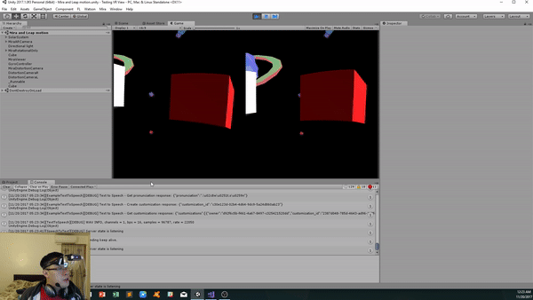

# Prism-Leap-Watson

## Project Overview 
* Using [Mira Prism](https://www.mirareality.com/) and [Leap Motion](https://www.leapmotion.com/), this allow the user to hand a controller free experience
* Using [Watson Services](https://www.ibm.com/watson/products-services/) : [Speech to Text](https://www.ibm.com/watson/services/speech-to-text/), [Text to Speech](https://www.ibm.com/watson/services/text-to-speech/), 
and [Conversation](https://www.ibm.com/watson/services/conversation/), user can create shapes by talking to Watson

## Setup 
#### Software/SDK
**Note this is for PC setup** 
* [Unity](https://store.unity.com/?_ga=2.174474786.1882622745.1511205620-1336275404.1503067450) - 2017.03f
* [Mira](https://www.mirareality.com/download)
* [Watson](https://github.com/watson-developer-cloud/unity-sdk): **Make sure you follow the before you begin section** You will need the api keys for STT,TTS, and Conversaion
* [Leap Motion](https://developer.leapmotion.com/get-started)
* [Leap Motion Core Assets](https://developer.leapmotion.com/unity/#116)
* [Leap Motion Interaction Engine](https://developer.leapmotion.com/unity/#116)
* Make sure you have download Unity Remote 5 on your iPhone and connect your phone to your desktop

#### Connect Mira with Leap Motion
1. Create a new unity project, import mira unity sdk and start with the 101_HelloWorld_ Scene 
2. Go to Edit -> Project Settings -> Editor Settings, Select your iPhone as a Device and Normal for Resolution, for game view have it 16:9
3. Hit Play and make sure you can look around 

4. Import the Leap Motion Core Assets into unity, go to LeapMotion -> Core -> Examples -> and drag the Leap Hands Demo (VR) into the scene 

5. Drag LMHeadMountedRig into MiraARCamera as a child then remove the Leap Hands Demo (VR) Scene 

6. Go to CenterEyeAnchor component that under LMHeadMountedRig and unchecked marked the camera component 
7. Attached your Leap Motion ontop of your Mira and press play 
8. You should now be able to see your hands models in the AR spaces. 

##### Tips 
- Change the color of the light source to white to see the hands more clear 

- If you go to LeapSpace under CenterEyeAnchor and checked Allow Manual Device Offset, you can manual change the Offset of the hands 

